# Currency Exchange Rate Service - Architecture Definition

## Table of Contents
1. [System Overview](#system-overview)
2. [Architecture Pattern](#architecture-pattern)
3. [High-Level Architecture](#high-level-architecture)
4. [Hexagonal Architecture Layers](#hexagonal-architecture-layers)
5. [Component Interaction Flow](#component-interaction-flow)
6. [Data Flow Diagrams](#data-flow-diagrams)
7. [AWS Infrastructure Architecture](#aws-infrastructure-architecture)
8. [Design Patterns](#design-patterns)
9. [Technology Stack](#technology-stack)

---

## System Overview

The Currency Exchange Rate Service is a serverless microservice that provides real-time and cached exchange rates through a REST API. It implements resilience patterns to ensure high availability even when external dependencies fail.

### Key Characteristics
- **Serverless**: AWS Lambda-based, no server management
- **Resilient**: Circuit breaker, cache fallback, retry logic
- **Scalable**: Auto-scales with API Gateway and Lambda
- **Cost-Effective**: Pay-per-use model, efficient caching
- **Observable**: Structured logging and CloudWatch metrics

---

## Architecture Pattern

**Hexagonal Architecture (Ports & Adapters)**

The system follows Hexagonal Architecture principles, ensuring:
- **Dependency Inversion**: Inner layers don't depend on outer layers
- **Testability**: Easy to mock external dependencies
- **Flexibility**: Easy to swap implementations (e.g., different providers, databases)
- **Clear Boundaries**: Well-defined interfaces between layers

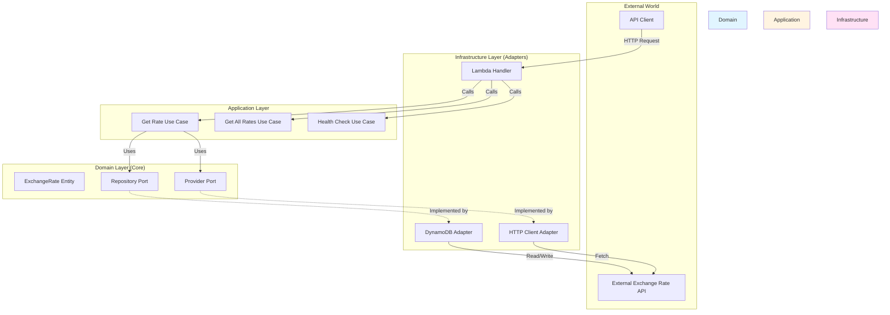

---

## High-Level Architecture

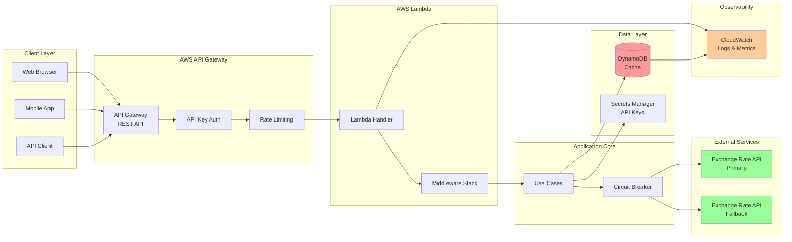

---

## Hexagonal Architecture Layers

### Layer Structure

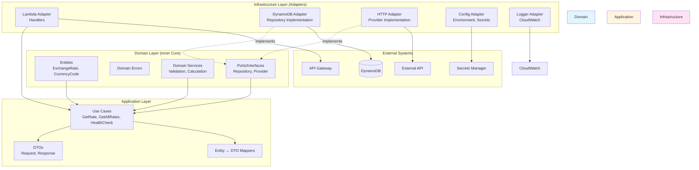

### Dependency Flow

**Rule**: Dependencies point INWARD (toward Domain)
- Infrastructure → Application → Domain ✅
- Domain → Application → Infrastructure ❌

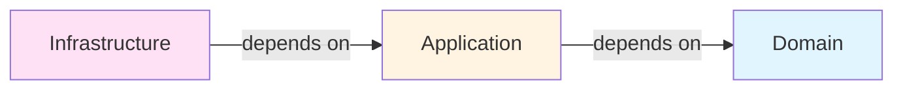

---

## Component Interaction Flow

### Get Exchange Rate Flow (UC1)

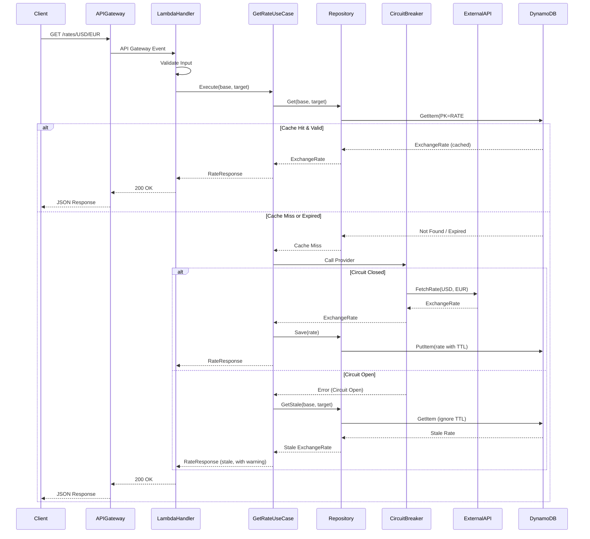

### Get All Rates Flow (UC2)

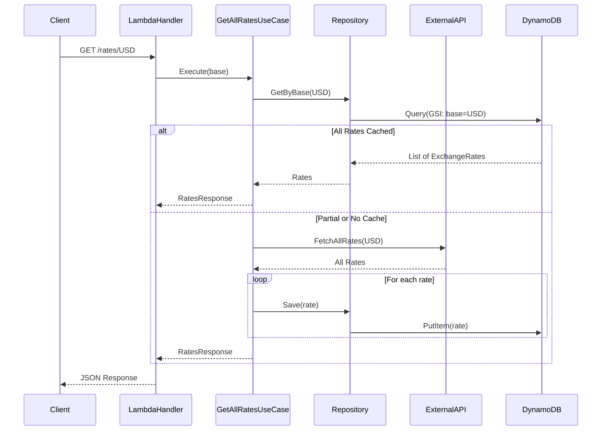

### Health Check Flow (UC3)

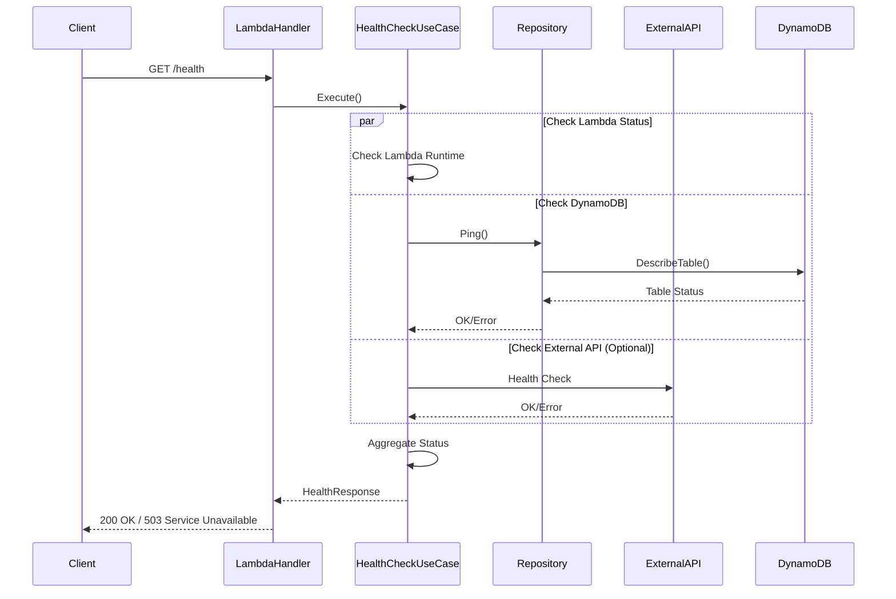

---

## Data Flow Diagrams

### Request Flow with Resilience

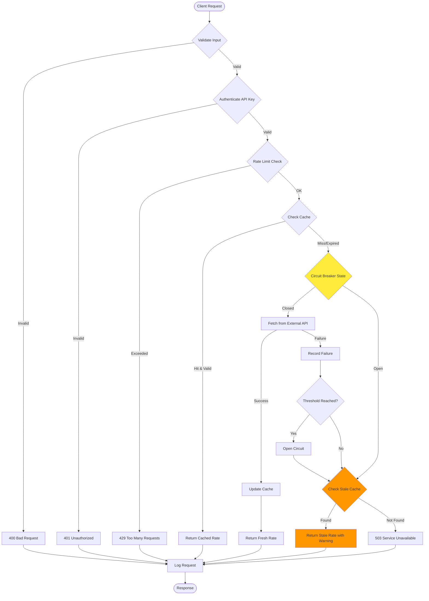

### Cache Strategy Flow

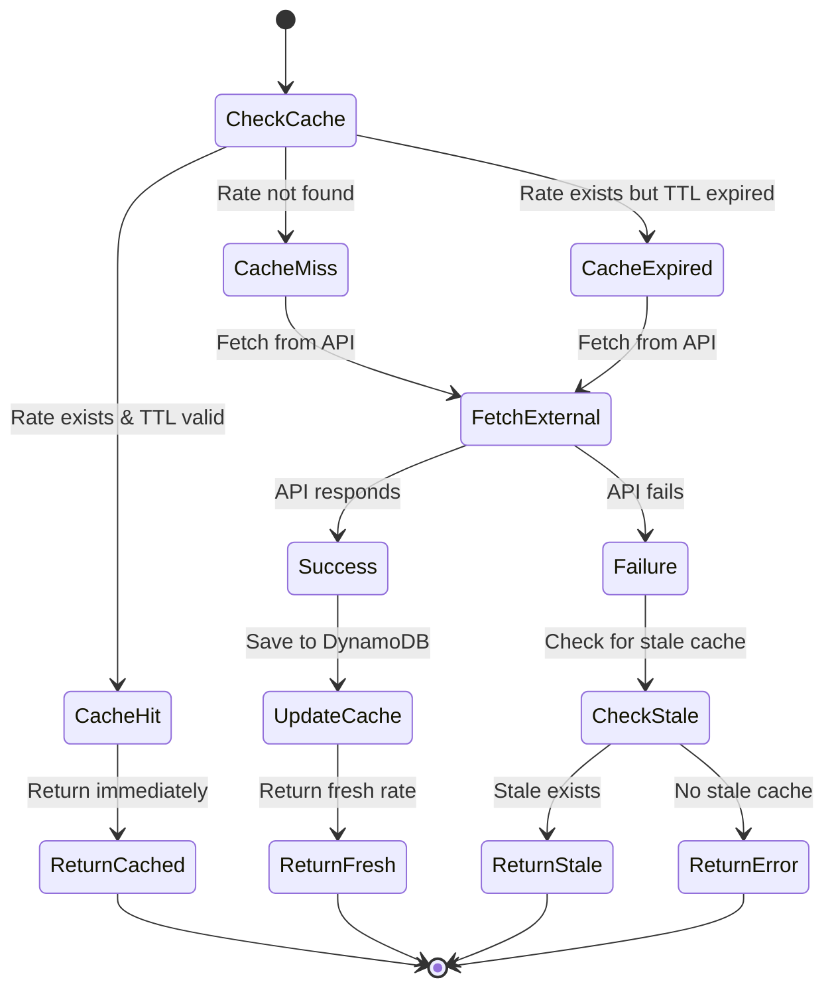

---

## AWS Infrastructure Architecture

### Infrastructure Components

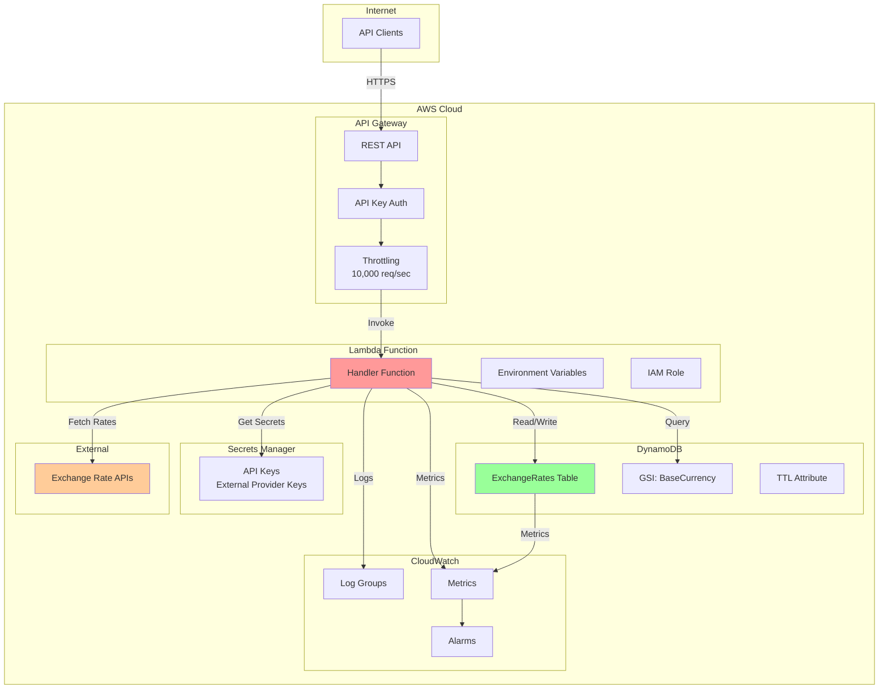

### DynamoDB Table Design

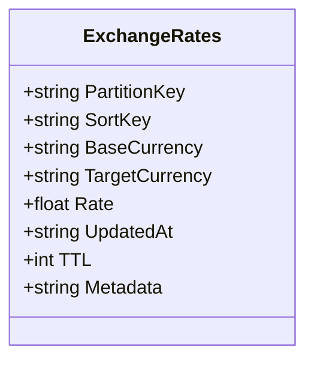

**Table Schema Details:**
- **Table Name**: `ExchangeRates`
- **Partition Key**: `PartitionKey` (stores values like `RATE#USD#EUR`)
- **Sort Key**: `SortKey` (optional, reserved for future use)
- **GSI**: `BaseCurrencyIndex` for querying all rates by base currency
  - GSI Partition Key: `BaseCurrency`
  - GSI Sort Key: `PartitionKey` (original partition key)
- **TTL Attribute**: `TTL` (Unix epoch timestamp)
- **Attributes**: `BaseCurrency`, `TargetCurrency`, `Rate`, `UpdatedAt`, `Metadata`

**Domain Entity Mapping:**
The DynamoDB table stores data that maps to the `ExchangeRate` domain entity:
- `PartitionKey` → Identifies the currency pair (format: `RATE#BASE#TARGET`)
- `BaseCurrency` → Domain entity `Base` field
- `TargetCurrency` → Domain entity `Target` field
- `Rate` → Domain entity `Rate` field
- `UpdatedAt` → Domain entity `Timestamp` field

### IAM Permissions

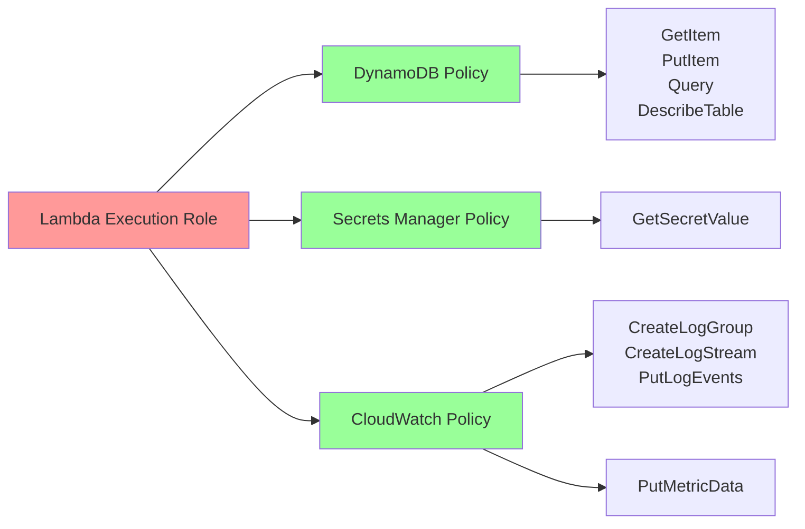

---

## Design Patterns

### Pattern Overview

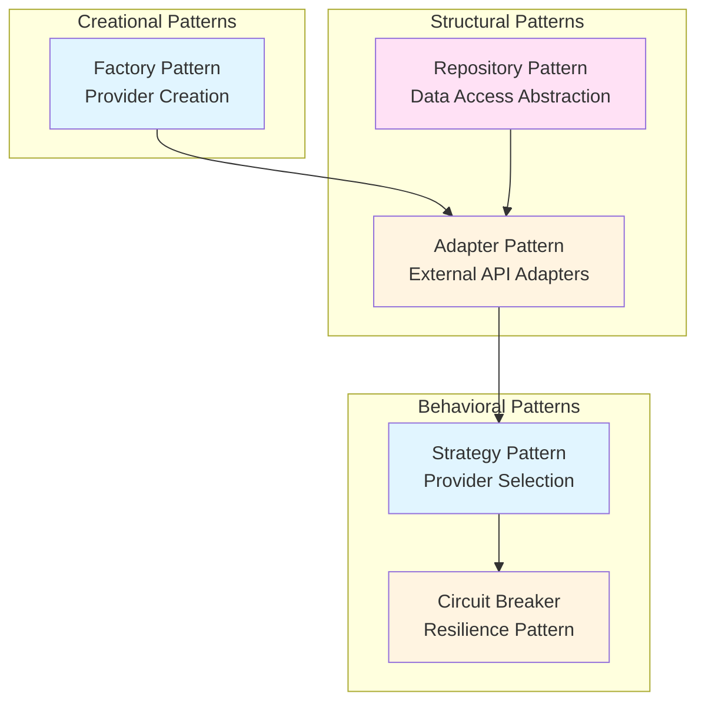

### Circuit Breaker State Machine

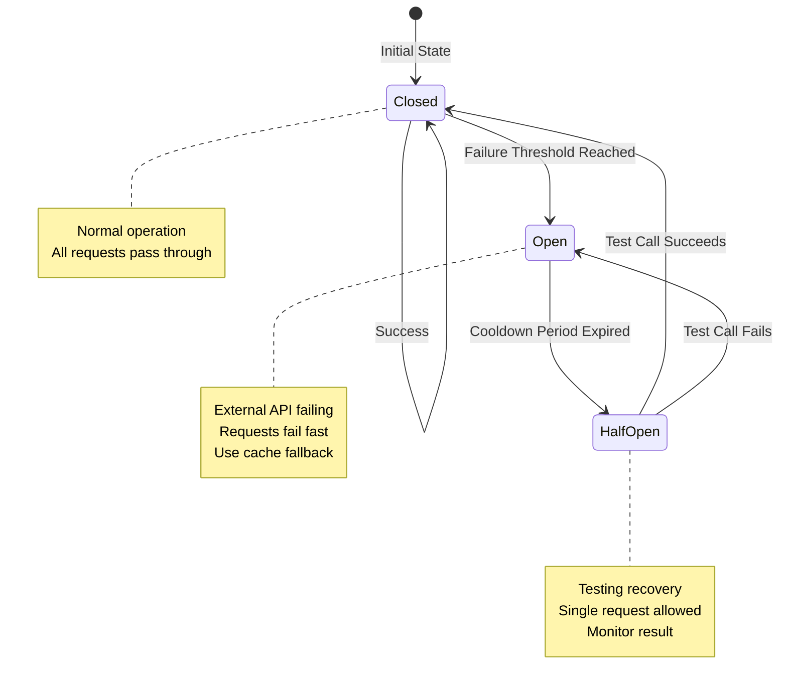

---

## Technology Stack

### Core Technologies

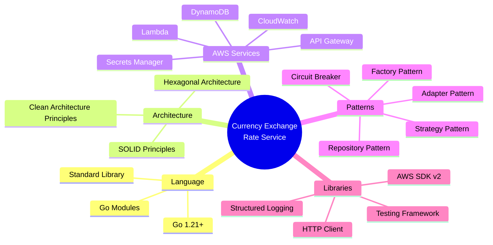

---

## Key Architectural Decisions

### 1. Hexagonal Architecture
**Decision**: Use Hexagonal Architecture (Ports & Adapters)  
**Rationale**: 
- Enables easy testing through interfaces
- Allows swapping implementations (e.g., different providers, databases)
- Clear separation of concerns
- Dependency inversion principle

### 2. Serverless Architecture
**Decision**: AWS Lambda + API Gateway  
**Rationale**:
- No server management
- Auto-scaling
- Cost-effective (pay-per-use)
- Fast deployment

### 3. DynamoDB for Caching
**Decision**: Use DynamoDB instead of Redis/ElastiCache  
**Rationale**:
- Serverless (no infrastructure management)
- Built-in TTL support
- Integrated with Lambda
- Cost-effective for this use case

### 4. Circuit Breaker Pattern
**Decision**: Implement circuit breaker for external API calls  
**Rationale**:
- Prevents cascading failures
- Fast failure when external API is down
- Enables graceful degradation with cache fallback

### 5. Cache-First Strategy
**Decision**: Always check cache before external API  
**Rationale**:
- Reduces external API calls (>80% reduction)
- Faster response times (<200ms for cached)
- Lower costs
- Better resilience

---

## Component Responsibilities

### Domain Layer
- **Entities**: Core business objects (ExchangeRate, CurrencyCode)
- **Ports**: Interfaces defining contracts (Repository, Provider)
- **Domain Services**: Business logic (validation, calculation)
- **Domain Errors**: Business-specific error types

### Application Layer
- **Use Cases**: Orchestrate business workflows
- **DTOs**: Data transfer objects for API boundaries
- **Mappers**: Convert between domain entities and DTOs

### Infrastructure Layer
- **Adapters**: Implement ports (DynamoDB, HTTP clients)
- **Handlers**: Lambda function handlers
- **Middleware**: Cross-cutting concerns (logging, validation)
- **Configuration**: Environment and secrets management

---

## Data Flow Summary

1. **Request** → API Gateway → Lambda Handler
2. **Handler** → Validates input, authenticates, rate limits
3. **Use Case** → Orchestrates business logic
4. **Repository** → Checks cache (DynamoDB)
5. **Provider** → Fetches from external API (if needed)
6. **Circuit Breaker** → Monitors provider health
7. **Cache** → Stores/retrieves rates with TTL
8. **Response** → Returns rate or error
9. **Logging** → Records all operations to CloudWatch

---

## Security Architecture

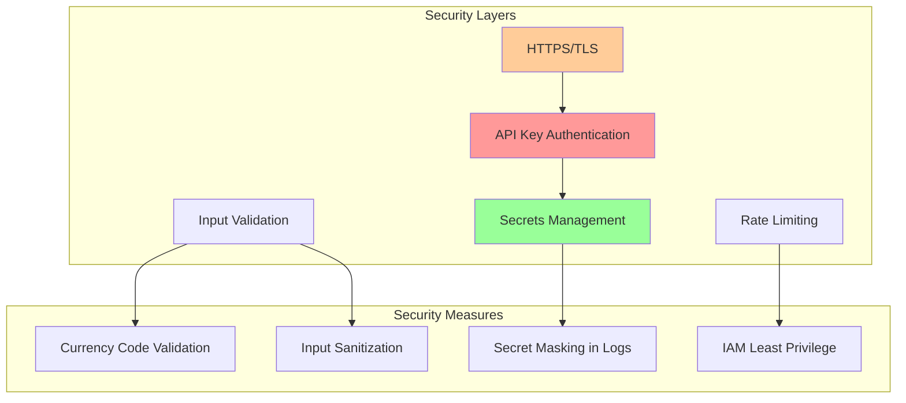

---

## Component Structure

### Detailed Codebase Organization

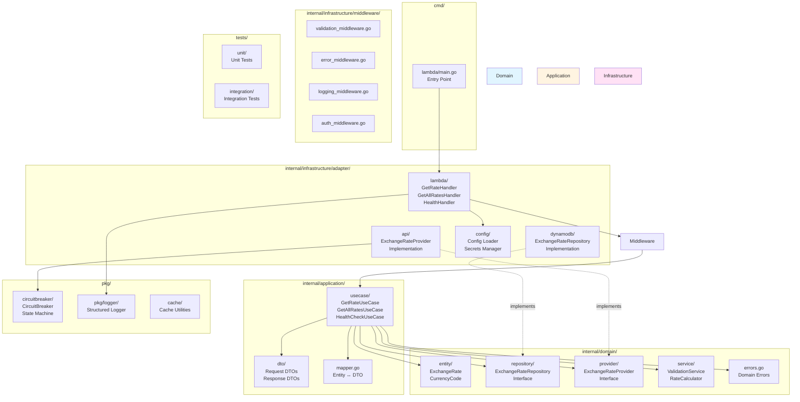

### Package Dependencies

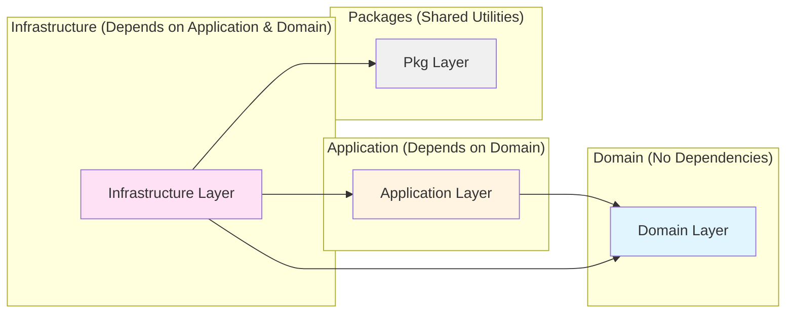

### File Structure Detail

```
go-currenseen/
├── cmd/
│   └── lambda/
│       └── main.go                    # Lambda entry point, dependency wiring
│
├── internal/
│   ├── domain/
│   │   ├── entity/
│   │   │   ├── exchange_rate.go       # ExchangeRate domain entity
│   │   │   └── currency_code.go       # CurrencyCode value object
│   │   ├── repository/
│   │   │   └── exchange_rate_repository.go  # Repository port (interface)
│   │   ├── provider/
│   │   │   └── exchange_rate_provider.go    # Provider port (interface)
│   │   ├── service/
│   │   │   ├── validation_service.go  # Domain validation logic
│   │   │   └── rate_calculator.go     # Rate calculation utilities
│   │   └── errors.go                  # Domain error types
│   │
│   ├── application/
│   │   ├── usecase/
│   │   │   ├── get_exchange_rate.go   # UC1: Get rate for pair
│   │   │   ├── get_all_rates.go       # UC2: Get all rates for base
│   │   │   └── health_check.go        # UC3: Health check
│   │   ├── dto/
│   │   │   ├── request.go             # Request DTOs
│   │   │   ├── response.go            # Response DTOs
│   │   │   └── mapper.go              # Entity ↔ DTO conversion
│   │
│   └── infrastructure/
│       ├── adapter/
│       │   ├── lambda/
│       │   │   ├── get_rate_handler.go
│       │   │   ├── get_rates_handler.go
│       │   │   └── health_handler.go
│       │   ├── dynamodb/
│       │   │   └── exchange_rate_repository.go  # Repository implementation
│       │   ├── api/
│       │   │   ├── exchange_rate_provider.go    # Provider implementation
│       │   │   ├── http_client.go                # HTTP client wrapper
│       │   │   └── provider_factory.go          # Factory for providers
│       │   └── config/
│       │       ├── config.go                    # Configuration loader
│       │       └── secrets.go                   # Secrets Manager integration
│       └── middleware/
│           ├── validation_middleware.go
│           ├── error_middleware.go
│           ├── logging_middleware.go
│           └── auth_middleware.go
│
├── pkg/
│   ├── circuitbreaker/
│   │   └── circuit_breaker.go         # Circuit breaker implementation
│   ├── logger/
│   │   └── logger.go                  # Structured logger
│   └── cache/
│       └── cache.go                   # Cache utilities
│
├── tests/
│   ├── unit/                          # Unit tests
│   └── integration/                   # Integration tests
│
├── infrastructure/
│   └── sam.yaml                       # AWS SAM template
│
├── docs/
│   ├── ARCHITECTURE.md                # This file
│   ├── INITIAL_SPEC.md                # Project specification
│   └── IMPLEMENTATION_PLAN.md         # Implementation phases
│
├── go.mod
├── go.sum
└── README.md
```

---

## Next Steps

After reviewing this architecture:

1. **Phase 0**: Set up project structure matching this architecture
2. **Phase 1**: Implement domain layer (entities, ports)
3. **Phase 2**: Implement application layer (use cases, DTOs)
4. **Phase 3+**: Implement infrastructure adapters incrementally

---

**Note**: This architecture document should evolve as the implementation progresses. Update it when making significant architectural decisions or changes.

