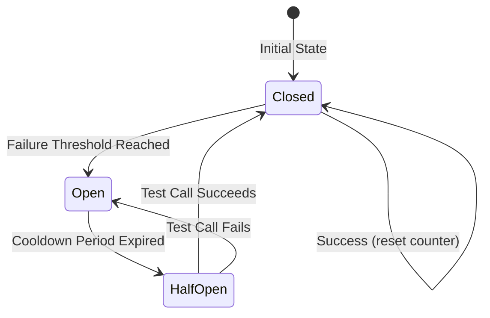

# Phase 5: Circuit Breaker Implementation

## Overview

**Goal**: Implement circuit breaker pattern for resilience when calling external exchange rate APIs.

**What We're Building**:
- Circuit breaker package with state machine (Closed, Open, HalfOpen)
- Thread-safe implementation using mutexes
- Failure counting and cooldown logic
- Integration with API provider
- Configuration support

**Why This Phase**:
- Prevents cascading failures when external API is down
- Enables fast failure (fail-fast pattern)
- Allows graceful degradation with cache fallback
- Demonstrates resilience patterns in Go

**Dependencies**: Phase 4 (External API Adapter) ✅ Complete

**Estimated Time**: 6-8 hours

---

## Step 1: Understand Circuit Breaker Pattern

**Objective**: Understand the circuit breaker state machine and behavior

**Why**: Clear understanding before implementation

**What to Do**:

### 1.1 Circuit Breaker States

**Three States**:

1. **Closed** (Normal Operation)
   - All requests pass through
   - Failures are counted
   - When failure threshold is reached → transition to Open

2. **Open** (Failing Fast)
   - All requests fail immediately (no external API calls)
   - Cooldown period starts
   - After cooldown expires → transition to HalfOpen

3. **HalfOpen** (Testing Recovery)
   - Allows one test request
   - If test succeeds → transition to Closed
   - If test fails → transition back to Open

### 1.2 State Machine Diagram



### 1.3 Configuration Parameters

- **Failure Threshold**: Number of consecutive failures before opening (e.g., 5)
- **Cooldown Duration**: Time to wait before trying HalfOpen (e.g., 30 seconds)
- **Success Threshold**: Number of successes in HalfOpen to close (typically 1)

**Deliverable**: ✅ Understanding of circuit breaker pattern

**Time**: 15 minutes

---

## Step 2: Create Package Structure

**Objective**: Set up circuit breaker package

**Why**: Clear organization follows Go package conventions

**What to Do**:

1. Create directory structure:
   ```
   pkg/
     circuitbreaker/
       circuit_breaker.go
       circuit_breaker_test.go
   ```

2. Create empty files with package declarations

**Deliverable**: ✅ Package structure created

**Time**: 5 minutes

---

## Step 3: Define State and Configuration Types

**Objective**: Define state enum and configuration struct

**Why**: Type safety and clear configuration

**What to Do**:

### 3.1 Define State Type

```go
// State represents the circuit breaker state.
type State int

const (
    StateClosed State = iota
    StateOpen
    StateHalfOpen
)

func (s State) String() string {
    switch s {
    case StateClosed:
        return "Closed"
    case StateOpen:
        return "Open"
    case StateHalfOpen:
        return "HalfOpen"
    default:
        return "Unknown"
    }
}
```

### 3.2 Define Configuration

```go
// Config holds circuit breaker configuration.
type Config struct {
    FailureThreshold int           // Number of failures before opening
    CooldownDuration time.Duration // Time to wait before HalfOpen
    SuccessThreshold int           // Successes needed in HalfOpen to close (typically 1)
}

// DefaultConfig returns a default circuit breaker configuration.
func DefaultConfig() Config {
    return Config{
        FailureThreshold: 5,
        CooldownDuration: 30 * time.Second,
        SuccessThreshold: 1,
    }
}
```

**Deliverable**: ✅ State and configuration types defined

**Time**: 20 minutes

---

## Step 4: Implement Circuit Breaker Core Logic

**Objective**: Implement the circuit breaker with state machine

**Why**: Core functionality for resilience

**What to Do**:

### 4.1 Create Circuit Breaker Struct

```go
// CircuitBreaker implements the circuit breaker pattern.
type CircuitBreaker struct {
    mu              sync.RWMutex
    state           State
    config          Config
    failureCount    int
    successCount    int
    lastFailureTime time.Time
    lastStateChange time.Time
}
```

### 4.2 Implement State Management

- `State()` - Get current state (thread-safe)
- `Allow()` - Check if request is allowed
- `RecordSuccess()` - Record successful call
- `RecordFailure()` - Record failed call
- `reset()` - Reset counters (private)

**Key Points**:
- Use `sync.RWMutex` for thread-safety
- State transitions must be atomic
- Track failure/success counts
- Track timestamps for cooldown

**Deliverable**: ✅ Circuit breaker core logic implemented

**Time**: 1.5 hours

---

## Step 5: Implement State Transitions

**Objective**: Implement state transition logic

**Why**: State machine behavior

**What to Do**:

### 5.1 Closed → Open Transition

- When failure count >= FailureThreshold
- Set state to Open
- Record timestamp
- Reset failure count

### 5.2 Open → HalfOpen Transition

- When cooldown period has elapsed
- Set state to HalfOpen
- Reset counters
- Allow one test request

### 5.3 HalfOpen → Closed Transition

- When test request succeeds
- Success count >= SuccessThreshold
- Set state to Closed
- Reset all counters

### 5.4 HalfOpen → Open Transition

- When test request fails
- Set state back to Open
- Start cooldown again

**Deliverable**: ✅ State transitions implemented

**Time**: 1 hour

---

## Step 6: Write Unit Tests

**Objective**: Test circuit breaker behavior

**Why**: Ensures correctness

**What to Do**:

### 6.1 Test State Transitions

- Test Closed → Open (failure threshold)
- Test Open → HalfOpen (cooldown)
- Test HalfOpen → Closed (success)
- Test HalfOpen → Open (failure)

### 6.2 Test Thread Safety

- Concurrent calls to Allow()
- Concurrent RecordSuccess/Failure
- Race condition detection

### 6.3 Test Configuration

- Default config
- Custom config
- Edge cases (zero values, etc.)

**Deliverable**: ✅ Comprehensive tests written

**Time**: 1.5 hours

---

## Step 7: Integrate with API Provider

**Objective**: Wrap provider with circuit breaker

**Why**: Makes provider resilient

**What to Do**:

### 7.1 Create Wrapper Provider

```go
// CircuitBreakerProvider wraps an ExchangeRateProvider with circuit breaker.
type CircuitBreakerProvider struct {
    provider       provider.ExchangeRateProvider
    circuitBreaker *circuitbreaker.CircuitBreaker
}
```

### 7.2 Implement Wrapper Methods

- Check circuit breaker before calling provider
- Record success/failure based on result
- Handle circuit open error

**Deliverable**: ✅ Circuit breaker integrated with provider

**Time**: 1 hour

---

## Step 8: Add Configuration

**Objective**: Add circuit breaker configuration

**Why**: Configurable behavior

**What to Do**:

In `internal/infrastructure/config/circuitbreaker.go`:

```go
// CircuitBreakerConfig holds circuit breaker configuration.
type CircuitBreakerConfig struct {
    FailureThreshold int
    CooldownDuration time.Duration
    SuccessThreshold int
}

// LoadCircuitBreakerConfig loads configuration from environment.
func LoadCircuitBreakerConfig() CircuitBreakerConfig {
    // Load from environment variables with defaults
}
```

**Deliverable**: ✅ Configuration implemented

**Time**: 30 minutes

---

## Step 9: Documentation and Code Review

**Objective**: Document and review implementation

**What to Do**:

1. Add code comments
2. Document state machine
3. Code review checklist

**Deliverable**: ✅ Code documented and reviewed

**Time**: 30 minutes

---

## Summary Checklist

Before considering Phase 5 complete:

- [x] Package structure created
- [x] State and configuration types defined
- [x] Circuit breaker core logic implemented
- [x] State transitions implemented
- [x] Thread safety verified
- [x] Unit tests written and passing
- [x] Integration with provider implemented
- [x] Configuration implemented
- [x] Code documented
- [x] Code reviewed

**Status**: ✅ **Phase 5 Complete** - All checklist items verified and completed.

**Code Review Document**: See `docs/PHASE_5_CODE_REVIEW.md` for detailed review.

---

## Estimated Total Time

- Step 1: 15 minutes
- Step 2: 5 minutes
- Step 3: 20 minutes
- Step 4: 1.5 hours
- Step 5: 1 hour
- Step 6: 1.5 hours
- Step 7: 1 hour
- Step 8: 30 minutes
- Step 9: 30 minutes

**Total**: ~6.5-7 hours

---

## Next Steps

After Phase 5 completion:
- Phase 6: Cache Strategy & Fallback Logic
- Phase 7: Lambda Handlers
